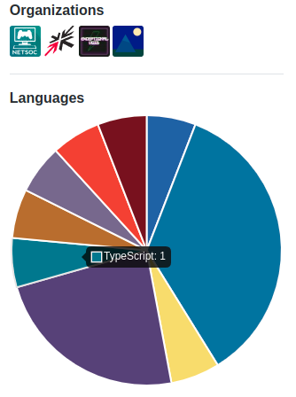

# GitHub User Languages
A little Chrome Extension that draws a pie chart on GitHub User profiles detailing their language breakdown. Built with TypeScript, Chart.js and :heart:.

Recently, I have wanted a little graph that shows the language breakdown of a user right on their profile.

So I decided to make just that!

## Install
### Chrome

Click the badge to be taken to the web store page for this plugin!

*It's currently giving me 404s but I feel like that's a temporary thing probably*

### Firefox
Firefox version is planned but currently not even started, although I doubt there'll be much to change.

## Usage
Just by having the extension installed, it's already working!

Simply visit a User's profile page (why not [mine](https://github.com/crnbrdrck)?) and you'll see something to similar to the following image on the left sidebar: 

All the colours are pulled from GitHub's official language colours, and hovering over any section will tell you the language and how many repos the user has made in that language. Simple! :smile:

Also, by clicking on one of the segments, you can be redirected to a list of repos by that user in that language!

## Roadmap

- [x] Draw the pie chart
- [x] Design an extension icon (have added a basic one but have put a claim in for one of the `openlogos` logos too)
- [x] Make it available on the chrome store (uploaded but still currently 404ing for me)
- [ ] Add storage of data for users to avoid over-using the Github API and getting rate limited
- [ ] Create a version for Firefox browsers

## Want to Contribute?
Contributing doesn't just mean writing code!

If you think of anything that could benefit the project, open up an [issue](https://github.com/crnbrdrck/github-user-langs/issues).

I'm also not that great at writing READMEs so help with this one would be very welcome!

## Boilerplate
Boilerplate used to set up this project can be found at https://github.com/chibat/chrome-extension-typescript-starter

## License
MIT
